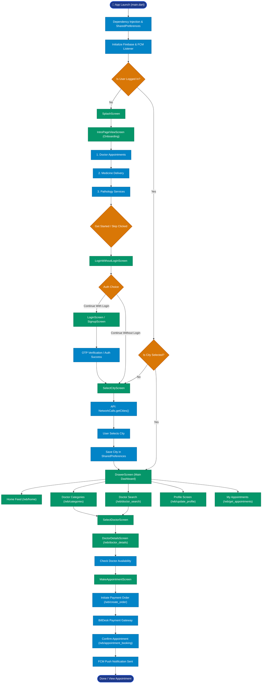
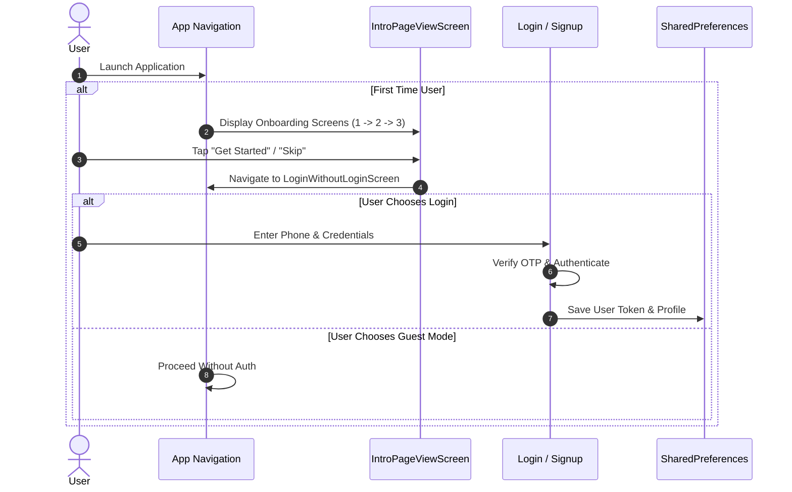
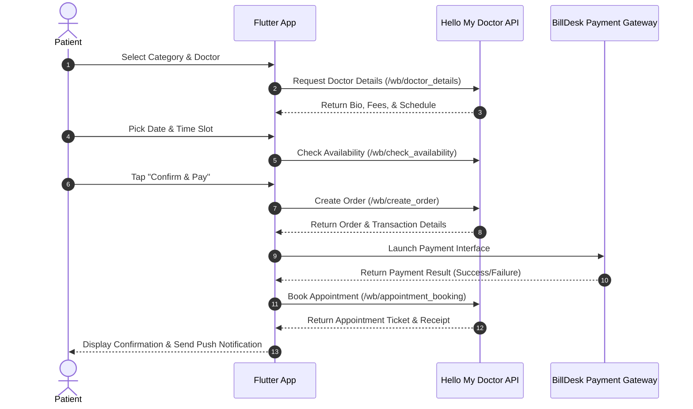

# A to Z Application Process Flow & System Architecture
**Project:** Hello My Doctor (`flutter_hello_my_doctor`)  
**Document Type:** Process Flow Diagram & Navigation Architecture  

---

## 0. App Main Services, Purpose & Business Value

### 🩺 1. Doctor Appointments (घर बैठे डॉक्टर अपॉइंटमेंट)
- Apne city/location ke anusar kisi bhi speciality ke doctor (Cardiologist, Dentist, General Physician, Skin Specialist, etc.) ko search karna.
- Doctor ki availability aur consulting fees check karke online time-slot book karna.

### 🧪 2. Pathology & Lab Tests (सैंपल कलेक्शन सर्विस)
- India ke reputed pathology labs se lab test book karna.
- Lab technicians dwara Ghar baite sample collection ki suvidha.

### 💊 3. Medicine Home Delivery (दवा डिलीवरी)
- Doctor dwara likhi gayi medicine ko ghar par mangwana.

### 💳 4. Instant Online Payment & Confirmation
- BillDesk / Paytm gateway se instant online consultation fee pay karna.
- Automatic appointment confirmation ticket aur receipt praapt karna.

### 🔔 5. Smart Notifications & Reminders
- Upcoming appointments aur lab test reports ke updates Firebase Notifications dwara milna.

---

### 🎯 Business Value (Client / Users ke liye)
- **Patients ke liye**: Hospital me lambi lines me khade hue bina ghar se doctor book karna aur test karvana.
- **Doctors / Hospitals ke liye**: Apni daily booking manage karna aur new patients tak pahunchna.

---

## 1. High-Level A to Z System Flowchart

---

## 2. Detailed Phase Breakdown

### Phase 1: Application Launch & Initialization
1. **Entry Point (`lib/main.dart`)**:
   - `WidgetsFlutterBinding.ensureInitialized()` is invoked.
   - System UI overlay is configured for edge-to-edge portrait mode.
2. **Dependency Injection**:
   - Initializes `UserController`, `SelectCityController`, and `SharedPreferences`.
   - Reads stored `login`, `intro`, `userData`, and `selectedCity` states.
3. **Firebase & Push Notifications**:
   - Initializes Firebase App instance.
   - Registers FCM background and foreground listeners (`FirebaseNotifications.setupFCMListener()`).
   - Requests notification permissions.

---

### Phase 2: Onboarding & Authentication Flow

---

### Phase 3: City Selection & Home Dashboard
1. **City Selection (`SelectCityScreen`)**:
   - Executes `NetworkCalls.getCities()` (`/wb/locations` API endpoint).
   - Displays cities in a search-enabled grid view.
   - Upon selection, stores `selectedCity` data in `SharedPreferences`.
2. **Main Dashboard (`DrawerScreen`)**:
   - Fetches home banners, quick categories, and recommended doctors (`/wb/home`).
   - Manages side drawer navigation (Profile, Appointments, Notifications, Help & Support).

---

### Phase 4: Doctor Appointment & Payment Lifecycle

